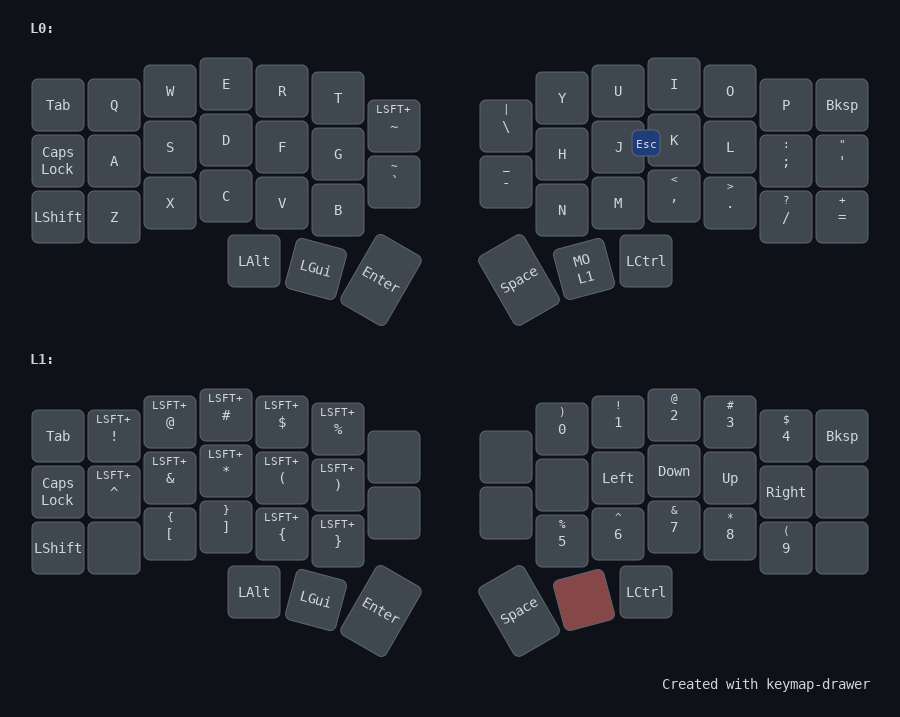

### Yay, my Corne!

(Very much still wip)

For ergonomics, meaning physical therapist telling me my shoulders, upper
back, and jawbone are definitely not happy with my posture (deep sigh). So...

#### Progress

- First layer ready: chars, primary control keys, some frecuent symbols
- Second layer: splitted numbers and symbols, not definitive tho.
- Third layer completely ignored so far. Will tackle that soon
- Fourth layer: keyboard hardware control (reboot. RGB lights...)

#### Keymaps

Layers 2 and 3 are mess so I'm not including them for now. 

